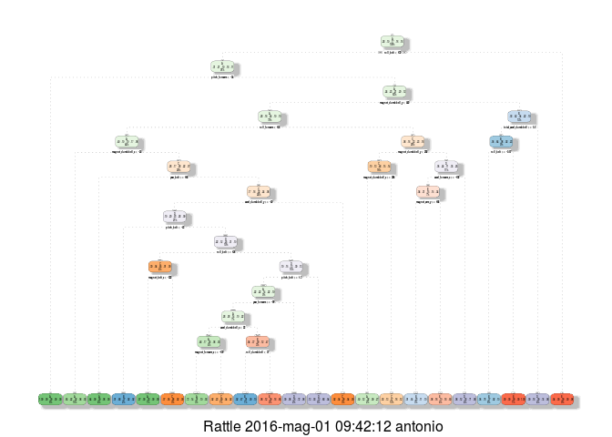
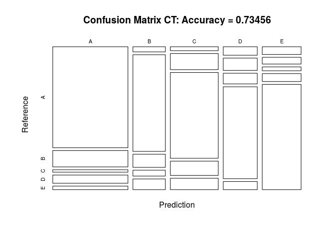
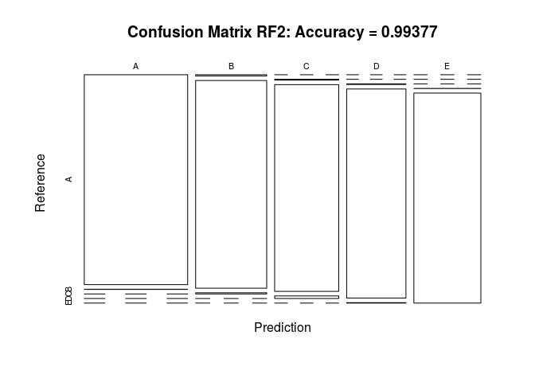
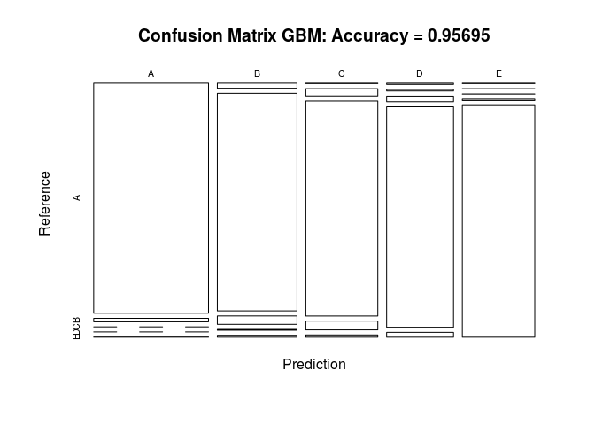
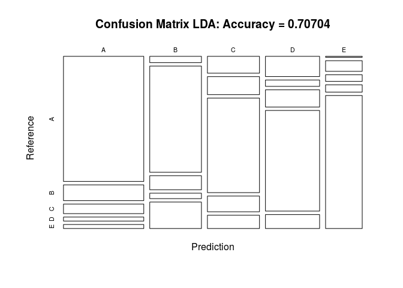

# Practical Machine Learning Course Project: Predicting barbell lifts performance quality
Antonio Ferraro  
30 April 2016  


## Synopsis

Based on a training and a testing data sets, obtained using devices such as Jawbone Up, Nike FuelBand, and Fitbit, the goal of this project is to produce a model which to predict how well a certain exercise has been performed. The data contains measurements about 6 participants who were asked to perform barbell lifts correctly and incorrectly in 5 different ways. The results are in the "classe" variable in the training set. 

So, the question is: "Given the available data, how well can we predict the quality of the execution of the activity?" 


## Data Processing
The data sets are loaded and explored. 


```r
# URLS 
trainingUrl  <- "https://d396qusza40orc.cloudfront.net/predmachlearn/pml-training.csv"
testingUrl   <- "https://d396qusza40orc.cloudfront.net/predmachlearn/pml-testing.csv"
# FILES
trainingFile <- "pml-training.csv"
testingFile  <- "pml-testing.csv"
# Download Files
download.file(url=trainingUrl, destfile=trainingFile)
download.file(url=testingUrl, destfile = testingFile)
# DATAFRAMES. I consider empty fields as NA
training    <- read.csv(trainingFile, na.strings=c("NA", "", "#DIV/0!"), header=TRUE)
testing     <- read.csv(testingFile,  na.strings=c("NA", "", "#DIV/0!"), header=TRUE)
dim(training)
```

```
## [1] 19622   160
```

```r
dim(testing)
```

```
## [1]  20 160
```

## Considerations and data cleanup

The testing set must in reality be the submission set for the project quiz as the number of observations is 20 and this is too small for a testing set. Furthermore it does not contain the classe field, so we cannot actually use it for evaluation. So, from now on this will be the "forSubmission" dataframe. I rename the dataframes to be in line with the course slides, then I proceed to a classical training/testing split of the training set as seen in the course lessons. As I am on a slow PC and the training part is what takes more time, I reduce the size of the training set to .55 (testing .45). I am not sure that this really affect the accuracy, it is actually likely that this will give me more conservative measures being my verifications performed on bigger data sets. I also proceed to some cleaning, removing not useful variables from all the dataframes. as well as variables (columns) which are mostly N/A. 


```r
# Need caret 
library(caret)

# Data for final quiz submission  
forSubmission <- testing  

# This is actually the dataset to split
data          <- training

# Set a seed for reproduceability 
set.seed(54321)

# Partitioning the data (Data Selection)
# I partition .55 and .45 to make training faster
inTraining  <- createDataPartition(data$classe, p=0.55, list=FALSE)
# Training and testing dataframes
training    <- data[inTraining, ]
testing     <- data[-inTraining, ]

# Verify sizes 
dim(training); dim(testing)
```

```
## [1] 10795   160
```

```
## [1] 8827  160
```

```r
# Cleaning data (Feature Selection): 
# Some variables not useful for predictions: 
# Index, Name, 3*timestamps, 2*window. They are the first 7.  
training       <- training[, -c(1:7)]

# I also look at the N/A values, it is unlikely that they 
# can be any good as predictors. I set the threshold to .4 (40%) 

toRemove <- NULL

for(i in 1:length(training)) {
    if( sum( is.na( training[, i] ) ) /nrow(training) >= .4) {
          if (exists("toRemove"))
                  toRemove       <- c(toRemove, names(training)[i])
          else
                  toRemove       <- c(names(training)[i])
    }
}

training  <- training[, !names(training) %in% toRemove]

# A check with  nearZeroVar with the default parameters to exclude "near zero-variance" predictors
# reveals that all the selected predictors should ve included 
# nearZeroVar(training, saveMetrics=TRUE) 
```
### Note 1: 
I do not need to remove the columns in the testing and forSubmission dataframes. The model built on training shall not contain 
any of the removed variables, so they shall also not be used (they shall be ignored) during prediction.

### Note 2: 
A check with  nearZeroVar with the default parameters (to exclude "near zero-variance" predictors)
reveals all the selected predictors should be included nearZeroVar(training, saveMetrics=TRUE) 
This does not change anything anyway, so I commented it in the code. 

## Creating alternative models and selecting the best one for prediction

The problem at hand is a classification problem as opposed to a regression problem. Therefore, 
I will create several classifiers among those seen in the course, I will compare their performances 
and select the best one to submit the results of the final quiz.  

### Classification Tree 

The first model I try is a basic classification tree, that I then plot and evaluate. 


```r
library(rpart)

# Set a seed for reproduceability:  
set.seed(54321)

modCT <- rpart(classe ~ ., data=training, method="class")
# During development only
# print(modCT, digits=3)

library(rattle)
fancyRpartPlot(modCT)
```



```r
# Evaluate against testing set  
predictionsCT <- predict(modCT, newdata=testing,  type = "class")
cmRP <- confusionMatrix(predictionsCT, testing$classe)
cmRP
```

```
## Confusion Matrix and Statistics
## 
##           Reference
## Prediction    A    B    C    D    E
##          A 2232  360   54  181   78
##          B   49  922  125   56  102
##          C   56  226 1209  201  160
##          D   85  123  107  919   81
##          E   88   77   44   90 1202
## 
## Overall Statistics
##                                           
##                Accuracy : 0.7346          
##                  95% CI : (0.7252, 0.7438)
##     No Information Rate : 0.2844          
##     P-Value [Acc > NIR] : < 2.2e-16       
##                                           
##                   Kappa : 0.6626          
##  Mcnemar's Test P-Value : < 2.2e-16       
## 
## Statistics by Class:
## 
##                      Class: A Class: B Class: C Class: D Class: E
## Sensitivity            0.8892   0.5398   0.7856   0.6351   0.7406
## Specificity            0.8935   0.9534   0.9118   0.9463   0.9585
## Pos Pred Value         0.7683   0.7352   0.6528   0.6989   0.8008
## Neg Pred Value         0.9531   0.8962   0.9527   0.9297   0.9425
## Prevalence             0.2844   0.1935   0.1744   0.1639   0.1839
## Detection Rate         0.2529   0.1045   0.1370   0.1041   0.1362
## Detection Prevalence   0.3291   0.1421   0.2098   0.1490   0.1700
## Balanced Accuracy      0.8914   0.7466   0.8487   0.7907   0.8495
```

```r
plot(cmRP$table, col = cmRP$byClass, main = paste("Confusion Matrix CT: Accuracy =", round(cmRP$overall['Accuracy'], 5)))
```



This model provides an accuracy of 0.7346 which is not good enough to achieve the 0.8 required to pass the quiz. 


### Random Forests 

Here I will generate a basic Random Forests model. The execution through the caret package takes way longer, to I call 
randomForest directly and with no parameters at all. 


```r
library(caret)
library(randomForest)
# Set a seed for reproduceability:  
set.seed(54321)

# This runs faster when called directly instead of using the caret package 
modRF2 <- randomForest(classe ~ ., data=training)
# print(modRF2, digits=3)

# Evaluate against testing set  
predictionsRF2 <- predict(modRF2, newdata=testing)
cmRF2 <- confusionMatrix(predictionsRF2, testing$classe)
cmRF2
```

```
## Confusion Matrix and Statistics
## 
##           Reference
## Prediction    A    B    C    D    E
##          A 2500    2    0    0    0
##          B   10 1700   10    0    0
##          C    0    6 1525   19    0
##          D    0    0    4 1427    3
##          E    0    0    0    1 1620
## 
## Overall Statistics
##                                           
##                Accuracy : 0.9938          
##                  95% CI : (0.9919, 0.9953)
##     No Information Rate : 0.2844          
##     P-Value [Acc > NIR] : < 2.2e-16       
##                                           
##                   Kappa : 0.9921          
##  Mcnemar's Test P-Value : NA              
## 
## Statistics by Class:
## 
##                      Class: A Class: B Class: C Class: D Class: E
## Sensitivity            0.9960   0.9953   0.9909   0.9862   0.9982
## Specificity            0.9997   0.9972   0.9966   0.9991   0.9999
## Pos Pred Value         0.9992   0.9884   0.9839   0.9951   0.9994
## Neg Pred Value         0.9984   0.9989   0.9981   0.9973   0.9996
## Prevalence             0.2844   0.1935   0.1744   0.1639   0.1839
## Detection Rate         0.2832   0.1926   0.1728   0.1617   0.1835
## Detection Prevalence   0.2834   0.1949   0.1756   0.1625   0.1836
## Balanced Accuracy      0.9978   0.9963   0.9937   0.9926   0.9990
```

```r
plot(cmRF2$table, col = cmRF2$byClass, main = paste("Confusion Matrix RF2: Accuracy =", round(cmRF2$overall['Accuracy'], 5)))
```



This model provides an accuracy of 0.994 which is a serious candidate to be the winner, with a very narrow CI, so a consistent performance over the test set. 


### A Generalized Boosting model 

This particular model is not built for accuracy, just to get a model comparable with the Random Forests. The options are tuned to keep  execution time low rather than to achieve higher precision. 


```r
# Set a seed for reproduceability:
set.seed(54321)
fitControl <- trainControl(method='cv', number=5, returnResamp='none',  classProbs = TRUE)
modGBM     <- train(classe ~ ., data= training, method="gbm", trControl=fitControl, verbose=F )
```

```
## Loading required package: gbm
```

```
## Loading required package: survival
```

```
## 
## Attaching package: 'survival'
```

```
## The following object is masked from 'package:caret':
## 
##     cluster
```

```
## Loading required package: splines
```

```
## Loading required package: parallel
```

```
## Loaded gbm 2.1.1
```

```
## Loading required package: plyr
```

```r
# print(modGBM, digits=3)

predictionsGBM <- predict(modGBM, newdata=testing)
cmGBM          <- confusionMatrix(predictionsGBM, testing$classe)
cmGBM
```

```
## Confusion Matrix and Statistics
## 
##           Reference
## Prediction    A    B    C    D    E
##          A 2458   37    0    0    2
##          B   38 1613   62    6   14
##          C    3   48 1441   59   15
##          D    8    9   35 1373   30
##          E    3    1    1    9 1562
## 
## Overall Statistics
##                                           
##                Accuracy : 0.957           
##                  95% CI : (0.9525, 0.9611)
##     No Information Rate : 0.2844          
##     P-Value [Acc > NIR] : < 2.2e-16       
##                                           
##                   Kappa : 0.9456          
##  Mcnemar's Test P-Value : 3.837e-08       
## 
## Statistics by Class:
## 
##                      Class: A Class: B Class: C Class: D Class: E
## Sensitivity            0.9793   0.9444   0.9363   0.9489   0.9624
## Specificity            0.9938   0.9831   0.9828   0.9889   0.9981
## Pos Pred Value         0.9844   0.9308   0.9202   0.9436   0.9911
## Neg Pred Value         0.9918   0.9866   0.9865   0.9900   0.9916
## Prevalence             0.2844   0.1935   0.1744   0.1639   0.1839
## Detection Rate         0.2785   0.1827   0.1632   0.1555   0.1770
## Detection Prevalence   0.2829   0.1963   0.1774   0.1648   0.1785
## Balanced Accuracy      0.9866   0.9638   0.9596   0.9689   0.9802
```

```r
plot(cmGBM$table, col = cmGBM$byClass, main = paste("Confusion Matrix GBM: Accuracy =", round(cmGBM$overall['Accuracy'], 5)))
```



Also not a bad performer either if compared with the simple Classification Tree, sufficient to pass the quiz with a very good confidence but worse than the Random Forests. 

### A linear discriminant analysis model

I also generate a simple linear discriminant analysis model for comparison.


```r
# Set a seed for reproduceability:
set.seed(54321)
modLDA <- train(classe ~ ., data= training, method="lda")
```

```
## Loading required package: MASS
```

```r
print(modLDA, digits=3)
```

```
## Linear Discriminant Analysis 
## 
## 10795 samples
##    52 predictors
##     5 classes: 'A', 'B', 'C', 'D', 'E' 
## 
## No pre-processing
## Resampling: Bootstrapped (25 reps) 
## Summary of sample sizes: 10795, 10795, 10795, 10795, 10795, 10795, ... 
## Resampling results:
## 
##   Accuracy  Kappa
##   0.693     0.612
## 
## 
```

```r
predictionsLDA <- predict(modLDA, newdata=testing)
cmLDA <- confusionMatrix(predictionsLDA, testing$classe)
cmLDA
```

```
## Confusion Matrix and Statistics
## 
##           Reference
## Prediction    A    B    C    D    E
##          A 2037  256  156   65   65
##          B   66 1113  147   57  277
##          C  178  190  998  166  140
##          D  222   70  189 1105  153
##          E    7   79   49   54  988
## 
## Overall Statistics
##                                           
##                Accuracy : 0.707           
##                  95% CI : (0.6974, 0.7165)
##     No Information Rate : 0.2844          
##     P-Value [Acc > NIR] : < 2.2e-16       
##                                           
##                   Kappa : 0.6295          
##  Mcnemar's Test P-Value : < 2.2e-16       
## 
## Statistics by Class:
## 
##                      Class: A Class: B Class: C Class: D Class: E
## Sensitivity            0.8116   0.6516   0.6485   0.7636   0.6087
## Specificity            0.9142   0.9232   0.9075   0.9141   0.9738
## Pos Pred Value         0.7898   0.6705   0.5969   0.6354   0.8394
## Neg Pred Value         0.9243   0.9170   0.9244   0.9517   0.9170
## Prevalence             0.2844   0.1935   0.1744   0.1639   0.1839
## Detection Rate         0.2308   0.1261   0.1131   0.1252   0.1119
## Detection Prevalence   0.2922   0.1881   0.1894   0.1970   0.1333
## Balanced Accuracy      0.8629   0.7874   0.7780   0.8389   0.7913
```

```r
plot(cmLDA$table, col = cmLDA$byClass, main = paste("Confusion Matrix LDA: Accuracy =", round(cmLDA$overall['Accuracy'], 5)))
```



This model would also not pass the classification quiz.


### Conclusions and predictions on the submission data

By comparing just the accuracy of the models on the testing data set, the best model is the Random Forests, followed by the 
Generalized Boosting Model. The other two models provide data to compare the performances. The simplest Random Forests model provides an accuracy of 0.994 and an out of sample error rate of 1-0.994 = 0.006, which is pretty good in my opinion without performing any type of optimization. 
The second best model is the Generalised Boosting Model, which again I did not push to any extent, with 0.957. On the forSubmission data set I get identical results to the random forests attempt, which is a good sign. The other two models, a Classification Tree model and a Linear discriminant Analysis model do not perform satisfactorily in comparison, with 0.734 and 0.707 respectively, so they would fail the prediction 
quiz which requires at least 80% correct responses.  


```r
# Building manually a comparison table 

resultsTable               <- NULL
resultsTable               <- data.frame(predict(modRF2, newdata=forSubmission))
resultsTable               <- cbind(resultsTable, predict(modGBM, newdata=forSubmission))
resultsTable               <- cbind(resultsTable, predict(modCT, newdata=forSubmission, type="class"))
resultsTable               <- cbind(resultsTable, predict(modLDA, newdata=forSubmission))
names(resultsTable)[1]     <- "1: RF"
names(resultsTable)[2]     <- "2: GBM"
names(resultsTable)[3]     <- "3: CT"
names(resultsTable)[4]     <- "4: LDA"
```


```r
library(htmlTable)
htmlTable(t(resultsTable))
```

<table class='gmisc_table' style='border-collapse: collapse; margin-top: 1em; margin-bottom: 1em;' >
<thead>
<tr>
<th style='border-bottom: 1px solid grey; border-top: 2px solid grey;'> </th>
<th style='border-bottom: 1px solid grey; border-top: 2px solid grey; text-align: center;'>1</th>
<th style='border-bottom: 1px solid grey; border-top: 2px solid grey; text-align: center;'>2</th>
<th style='border-bottom: 1px solid grey; border-top: 2px solid grey; text-align: center;'>3</th>
<th style='border-bottom: 1px solid grey; border-top: 2px solid grey; text-align: center;'>4</th>
<th style='border-bottom: 1px solid grey; border-top: 2px solid grey; text-align: center;'>5</th>
<th style='border-bottom: 1px solid grey; border-top: 2px solid grey; text-align: center;'>6</th>
<th style='border-bottom: 1px solid grey; border-top: 2px solid grey; text-align: center;'>7</th>
<th style='border-bottom: 1px solid grey; border-top: 2px solid grey; text-align: center;'>8</th>
<th style='border-bottom: 1px solid grey; border-top: 2px solid grey; text-align: center;'>9</th>
<th style='border-bottom: 1px solid grey; border-top: 2px solid grey; text-align: center;'>10</th>
<th style='border-bottom: 1px solid grey; border-top: 2px solid grey; text-align: center;'>11</th>
<th style='border-bottom: 1px solid grey; border-top: 2px solid grey; text-align: center;'>12</th>
<th style='border-bottom: 1px solid grey; border-top: 2px solid grey; text-align: center;'>13</th>
<th style='border-bottom: 1px solid grey; border-top: 2px solid grey; text-align: center;'>14</th>
<th style='border-bottom: 1px solid grey; border-top: 2px solid grey; text-align: center;'>15</th>
<th style='border-bottom: 1px solid grey; border-top: 2px solid grey; text-align: center;'>16</th>
<th style='border-bottom: 1px solid grey; border-top: 2px solid grey; text-align: center;'>17</th>
<th style='border-bottom: 1px solid grey; border-top: 2px solid grey; text-align: center;'>18</th>
<th style='border-bottom: 1px solid grey; border-top: 2px solid grey; text-align: center;'>19</th>
<th style='border-bottom: 1px solid grey; border-top: 2px solid grey; text-align: center;'>20</th>
</tr>
</thead>
<tbody>
<tr>
<td style='text-align: left;'>1: RF</td>
<td style='text-align: center;'>B</td>
<td style='text-align: center;'>A</td>
<td style='text-align: center;'>B</td>
<td style='text-align: center;'>A</td>
<td style='text-align: center;'>A</td>
<td style='text-align: center;'>E</td>
<td style='text-align: center;'>D</td>
<td style='text-align: center;'>B</td>
<td style='text-align: center;'>A</td>
<td style='text-align: center;'>A</td>
<td style='text-align: center;'>B</td>
<td style='text-align: center;'>C</td>
<td style='text-align: center;'>B</td>
<td style='text-align: center;'>A</td>
<td style='text-align: center;'>E</td>
<td style='text-align: center;'>E</td>
<td style='text-align: center;'>A</td>
<td style='text-align: center;'>B</td>
<td style='text-align: center;'>B</td>
<td style='text-align: center;'>B</td>
</tr>
<tr>
<td style='text-align: left;'>2: GBM</td>
<td style='text-align: center;'>B</td>
<td style='text-align: center;'>A</td>
<td style='text-align: center;'>B</td>
<td style='text-align: center;'>A</td>
<td style='text-align: center;'>A</td>
<td style='text-align: center;'>E</td>
<td style='text-align: center;'>D</td>
<td style='text-align: center;'>B</td>
<td style='text-align: center;'>A</td>
<td style='text-align: center;'>A</td>
<td style='text-align: center;'>B</td>
<td style='text-align: center;'>C</td>
<td style='text-align: center;'>B</td>
<td style='text-align: center;'>A</td>
<td style='text-align: center;'>E</td>
<td style='text-align: center;'>E</td>
<td style='text-align: center;'>A</td>
<td style='text-align: center;'>B</td>
<td style='text-align: center;'>B</td>
<td style='text-align: center;'>B</td>
</tr>
<tr>
<td style='text-align: left;'>3: CT</td>
<td style='text-align: center;'>C</td>
<td style='text-align: center;'>A</td>
<td style='text-align: center;'>B</td>
<td style='text-align: center;'>D</td>
<td style='text-align: center;'>A</td>
<td style='text-align: center;'>C</td>
<td style='text-align: center;'>D</td>
<td style='text-align: center;'>A</td>
<td style='text-align: center;'>A</td>
<td style='text-align: center;'>A</td>
<td style='text-align: center;'>C</td>
<td style='text-align: center;'>B</td>
<td style='text-align: center;'>A</td>
<td style='text-align: center;'>A</td>
<td style='text-align: center;'>E</td>
<td style='text-align: center;'>E</td>
<td style='text-align: center;'>A</td>
<td style='text-align: center;'>A</td>
<td style='text-align: center;'>A</td>
<td style='text-align: center;'>B</td>
</tr>
<tr>
<td style='border-bottom: 2px solid grey; text-align: left;'>4: LDA</td>
<td style='border-bottom: 2px solid grey; text-align: center;'>B</td>
<td style='border-bottom: 2px solid grey; text-align: center;'>A</td>
<td style='border-bottom: 2px solid grey; text-align: center;'>B</td>
<td style='border-bottom: 2px solid grey; text-align: center;'>C</td>
<td style='border-bottom: 2px solid grey; text-align: center;'>A</td>
<td style='border-bottom: 2px solid grey; text-align: center;'>E</td>
<td style='border-bottom: 2px solid grey; text-align: center;'>D</td>
<td style='border-bottom: 2px solid grey; text-align: center;'>D</td>
<td style='border-bottom: 2px solid grey; text-align: center;'>A</td>
<td style='border-bottom: 2px solid grey; text-align: center;'>A</td>
<td style='border-bottom: 2px solid grey; text-align: center;'>D</td>
<td style='border-bottom: 2px solid grey; text-align: center;'>A</td>
<td style='border-bottom: 2px solid grey; text-align: center;'>B</td>
<td style='border-bottom: 2px solid grey; text-align: center;'>A</td>
<td style='border-bottom: 2px solid grey; text-align: center;'>E</td>
<td style='border-bottom: 2px solid grey; text-align: center;'>A</td>
<td style='border-bottom: 2px solid grey; text-align: center;'>A</td>
<td style='border-bottom: 2px solid grey; text-align: center;'>B</td>
<td style='border-bottom: 2px solid grey; text-align: center;'>B</td>
<td style='border-bottom: 2px solid grey; text-align: center;'>B</td>
</tr>
</tbody>
</table>

The Random Forests classifier is the model I will use to submit my answers to the quiz. 

### Acknowledgements 

As all the other students doing this project, I owe the data set and a word of thanks to:  

Ugulino, W.; Cardador, D.; Vega, K.; Velloso, E.; Milidiu, R.; Fuks, H. Wearable Computing: Accelerometers' Data Classification of Body Postures and Movements. Proceedings of 21st Brazilian Symposium on Artificial Intelligence. Advances in Artificial Intelligence - SBIA 2012. In: Lecture Notes in Computer Science. , pp. 52-61. Curitiba, PR: Springer Berlin / Heidelberg, 2012. ISBN 978-3-642-34458-9. DOI: 10.1007/978-3-642-34459-6_6.

(http://groupware.les.inf.puc-rio.br/har)

Furthermore, many thanks to Len Greski for his beautiful guide on setting up gh-pages on github (https://github.com/lgreski/datasciencectacontent/blob/master/markdown/pml-ghPagesSetup.md).


